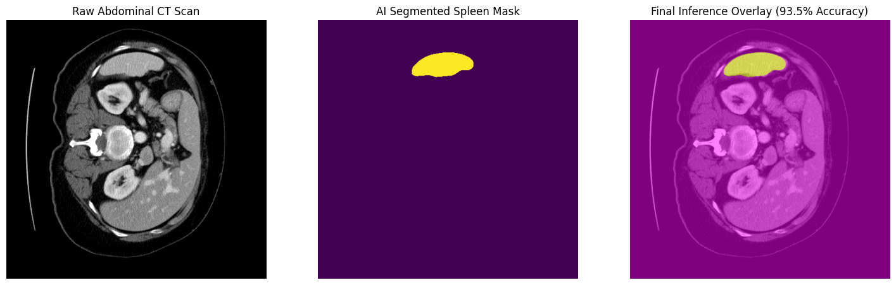
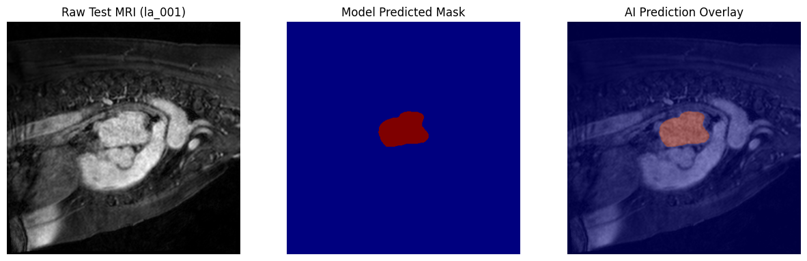
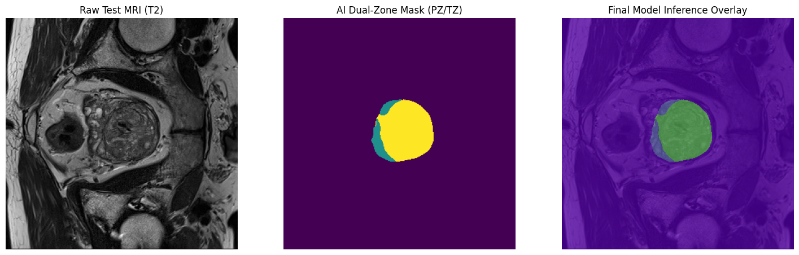

# Anatomical Digital Twin: 3D Medical Segmentation & Visualization Pipeline

[](https://github.com/astralranger/nnUNet)
[](https://github.com/MIC-DKFZ/nnUNet)
[](./3d-medical-dashboard)

An end-to-end clinical visualization pipeline that transforms raw volumetric medical imaging (NIfTI) into highly optimized, topologically sound 3D anatomical models for real-time web deployment.

## 🚀 Technical Overview

This project implements a robust medical imaging stack focusing on the **segmentation, refinement, and real-time rendering** of multiple organs (Heart, Spleen, Prostate, Hippocampus). The core contribution is a custom **Morphological Optimization Layer** that bridges the gap between raw AI voxel predictions and high-performance 3D meshes.

### 🏗️ System Architecture

1.  **Segmentation Engine**: Leveraging `nnU-Net V2` for self-configuring 3D U-Net segmentation on medical datasets.
2.  **Refinement Pipeline**: Custom Python scripts applying **Binary Hole Filling**, **Opening**, and **Closing** operations to remove segmentation noise and "floating debris."
3.  **Mesh Extraction**: Implementation of the **Marching Cubes Algorithm** to convert optimized voxel grids into decimated JSON/STL meshes.
4.  **Digital Twin Interface**: A React-based dashboard using `Three.js` (React-Three-Fiber) for interactive anatomical analysis, cross-section slicing, and morphological impact reporting.

---

## 📊 Key Results & Morphological Impact

The post-processing layer significantly improves mesh topology for web-based rendering:

*   **Noise Removal**: Binary Opening eliminated ~2,000+ disconnected voxels in Spleen datasets.
*   **Geometric Optimization**: Achieved a **-8.3% vertex reduction** in optimized meshes, enhancing real-time FPS without losing anatomical fidelity.
*   **Watertight Geometry**: Binary Closing corrected internal gaps, ensuring clinically accurate volume calculations.

| Organ | Showcase | Metric Summary |
| :--- | :--- | :--- |
| **Spleen** |  | Optimized Surface Geometry |
| **Heart** |  | Multiphase Segmentation |
| **Prostate** |  | Metric Graphing & Validation |

---

## 📁 Repository Structure

```bash
├── 3d-medical-dashboard/  # React + Vite + Three.js Frontend
├── Reports/               # Technical documentation & Poster content
├── Results/               # Exported Mesh GIFs, PNGs, and Analysis Graphs
│   ├── heart-results/
│   ├── spleen-results/
│   └── ...
├── nnUNet/                # Submodule: Forked nnU-Net V2 Engine
├── data/                  # Symlinks to Medical Datasets (Task02, Task04, etc.)
└── .gitignore             # Configured to exclude heavy NIfTI data while tracking results
```

## 📂 Datasets

- **Medical Segmentation Decathlon** – Official dataset repository: https://medicaldecathlon.com/

---

